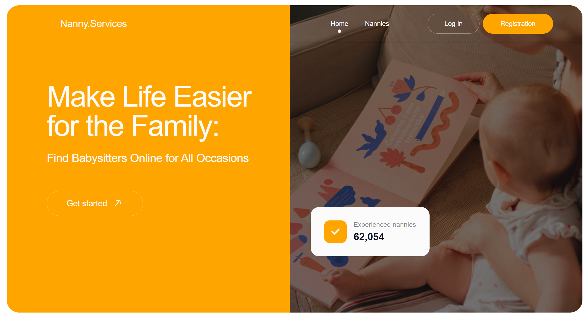

 <h1>Nannies.Services</h1>

<h2>An application where you can search and book nanny.</h2>
 

 <h1>About project</h1>
 <h2><a href="https://www.figma.com/file/u36ajEOsnwio2GDGiabVPD/Nanny-Sevices?type=design&node-id=0-1&mode=design&t=CZpMnnOCRwAYc81O-0">Layout</a></h2>
 <h2><a href="https://www.figma.com/file/u36ajEOsnwio2GDGiabVPD/Nanny-Sevices?type=design&node-id=0-1&mode=design&t=CZpMnnOCRwAYc81O-0)](https://docs.google.com/document/d/19ugM1gvOw81nCyALr4EZs3dmv6OfJm94VjupcytbnJY/edit">Technical task</a></h2>
<h3>For unauthorized users:</h3>
<ul><li>Possibility of login and registration; </li>
<li>Possibility to view the list of babysitters;</li>
<li>Possibility to filter babysitters by price, alphabet, and popularity;</li>
<li>An opportunity to make an appointment with a nanny;</li></ul>
<h3>For authorized users additionally:</h3>
<ul><li>Possibility to add a babysitter to your favorites; </li>
<li>Possibility to filter your favorite babysitters;</li>
</ul>
 <h1>Used technologies</h1>
 

 &nbsp;
  &nbsp;
  &nbsp;
  &nbsp;
  &nbsp;
    &nbsp;
        &nbsp;
        &nbsp;
         &nbsp;
  

 
